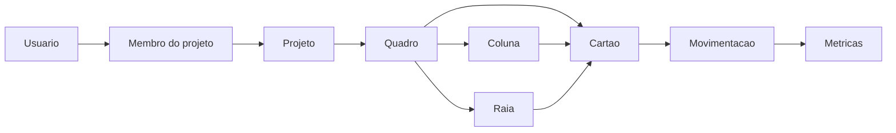

# Architecture Notebook

## Finalidade

Este documento registra a arquitetura proposta para o Wiigu. O objetivo e explicar os elementos principais do sistema, seus relacionamentos, as decisoes de projeto, as restricoes consideradas, os mecanismos arquiteturais e o impacto das ferramentas usadas no prototipo.

## Contexto

O Wiigu e uma aplicacao web de apoio a gestao visual de projetos por Kanban. O sistema permite autenticar usuarios, organizar projetos, criar quadros, criar raias, criar cartoes, mover cartoes entre colunas e raias, definir limite WIP e calcular metricas Kanban.

Cada quadro Kanban do prototipo deve possuir as colunas obrigatorias `A FAZER`, `FAZENDO` e `FEITO`.

## Objetivos arquiteturais

- Entregar um prototipo web funcional e demonstravel.
- Separar apresentacao, regras de negocio e persistencia.
- Manter uma estrutura simples, adequada ao escopo academico.
- Permitir rastrear funcionalidades ate requisitos, telas, banco e testes.
- Registrar movimentacoes de cartoes para viabilizar metricas Kanban.

## Suposicoes

- O prototipo sera executado em ambiente local para demonstracao.
- Os usuarios acessarao o sistema por navegador web moderno.
- O volume de dados sera pequeno, pois o foco e demonstrar os servicos obrigatorios.
- A seguranca sera basica, suficiente para cadastro, autenticacao e sessao.
- O sistema nao dependera de integracao externa para cumprir os requisitos do trabalho.
- O login com Google e uma integracao opcional, habilitada apenas quando houver credenciais OAuth configuradas.
- A equipe usara controle de versao para organizar os artefatos e o codigo.

## Dependencias consideradas

- Requisitos funcionais e historias de usuario definem os servicos que a arquitetura deve suportar.
- Requisitos nao funcionais definem restricoes de usabilidade, desempenho, seguranca, persistencia e documentacao.
- Projeto fisico do banco define entidades, chaves e relacionamentos usados pela implementacao.
- Projeto de interface define os fluxos de tela que consomem as regras de negocio.
- Roteiro de testes define os cenarios que o prototipo precisa demonstrar.

## Requisitos arquiteturalmente significativos

- Autenticacao de usuarios antes do acesso aos servicos.
- Persistencia de usuarios, projetos, quadros, raias, colunas, cartoes e movimentacoes.
- Criacao automatica das colunas `A FAZER`, `FAZENDO` e `FEITO` para cada quadro.
- Registro de movimentacoes para calcular lead time, cycle time, throughput e WIP.
- Controle de limite WIP por coluna.
- Interface grafica web para manipulacao do quadro.
- Movimentacao de cartoes por acao direta na tela, incluindo arrastar e soltar no quadro.

## Decisoes arquiteturais

### DA-01: Aplicacao web

Decisao: implementar o Wiigu como aplicacao web.

Justificativa: o navegador facilita demonstracao, reduz dependencia de instalacao e atende ao ambiente esperado para o prototipo.

### DA-02: Separacao em camadas

Decisao: organizar o prototipo em apresentacao, regras de negocio e persistencia.

Justificativa: a separacao reduz acoplamento e permite explicar o sistema segundo conceitos de Engenharia de Software. A camada de apresentacao trata telas e interacoes. A camada de negocio trata validacoes, movimentacoes, WIP e metricas. A camada de persistencia trata acesso ao banco.

### DA-03: Stack tecnica do prototipo

Decisao: usar uma aplicacao web com frontend em React, API em Node.js/Express e banco SQLite.

Justificativa: essa combinacao permite construir rapidamente um prototipo integrado, com interface grafica, rotas de servico e persistencia local. O SQLite e suficiente para o volume de dados do trabalho e simplifica a demonstracao.

### DA-04: Historico de movimentacoes

Decisao: registrar cada mudanca relevante de coluna ou raia em uma tabela de movimentacoes.

Justificativa: as metricas Kanban dependem de datas de criacao, inicio, conclusao e movimentacao. Sem historico, o sistema ate poderia mostrar o estado atual dos cartoes, mas nao conseguiria calcular corretamente lead time, cycle time e throughput.

### DA-05: Colunas obrigatorias inicializadas pelo sistema

Decisao: ao criar um quadro, o sistema deve criar automaticamente as colunas `A FAZER`, `FAZENDO` e `FEITO`.

Justificativa: o enunciado exige essas colunas em cada quadro Kanban. Criar as colunas automaticamente reduz erro do usuario e garante aderencia ao requisito.

### DA-06: Login Google configuravel

Decisao: preparar o login federado com Google como opcao configuravel por variaveis de ambiente.

Justificativa: o fluxo local de cadastro e login continua suficiente para executar o prototipo sem dependencia externa. Quando houver OAuth Client ID configurado, o sistema valida o ID token no backend antes de criar sessao local.

### DA-07: WIP validado na API

Decisao: validar o limite WIP na API durante criacao e movimentacao de cartoes.

Justificativa: a regra de WIP deve valer para qualquer forma de interacao da interface, incluindo formulario, botoes de movimentacao e drag-and-drop.

## Restricoes

- O prototipo deve caber no prazo do trabalho pratico.
- A interface deve ser simples e suficiente para demonstrar os servicos.
- As tecnologias escolhidas devem permitir execucao local.
- O sistema nao tera integracoes externas obrigatorias.
- O controle de permissao sera basico, adequado ao escopo academico.

## Mecanismos arquiteturais

- Autenticacao e sessao.
- Validacao de formularios.
- Inicializacao das colunas obrigatorias do quadro.
- Repositorios ou servicos de acesso a dados.
- Registro de movimentacoes de cartoes.
- Calculo de metricas Kanban.
- Controle visual de limite WIP.
- Bloqueio de movimentacao quando o limite WIP da coluna de destino for atingido.
- Login federado opcional com validacao de token Google no servidor.
- Tratamento de mensagens de erro e validacao.

## Abstracoes principais

- `User`: representa usuario autenticavel.
- `Project`: representa agrupamento de trabalho.
- `ProjectMember`: representa participacao de usuario em projeto.
- `Board`: representa quadro Kanban de um projeto.
- `BoardColumn`: representa coluna do fluxo do quadro.
- `Swimlane`: representa raia do quadro.
- `Card`: representa atividade do quadro.
- `CardMovement`: representa alteracao de coluna ou raia.
- `MetricService`: calcula lead time, cycle time, throughput e WIP.
- `AuthService`: controla cadastro, login local, login Google opcional, logout e sessao.

## Perspectiva logica

O sistema e organizado em torno de entidades de dominio ligadas ao gerenciamento visual de atividades. Um usuario pode participar de projetos. Um projeto contem quadros. Um quadro contem colunas, raias e cartoes. Um cartao pertence a uma coluna e a uma raia. Cada movimentacao registra mudanca de coluna ou raia.

## Perspectiva de desenvolvimento

O codigo deve ser organizado para preservar a separacao entre interface, negocio e persistencia:

- frontend: telas, componentes, formularios e interacoes do quadro;
- backend/API: rotas para usuarios, projetos, quadros, raias, cartoes, movimentacoes e metricas;
- dominio/servicos: validacoes, WIP, movimentacoes e calculo de metricas;
- persistencia: consultas e comandos SQL.

Essa organizacao ajuda a manter coerencia entre os documentos e o prototipo.

## Perspectiva de processo

As principais operacoes seguem fluxos simples:

1. Usuario cria conta e autentica.
2. Usuario acessa ou cria projeto.
3. Usuario cria quadro, que recebe colunas obrigatorias.
4. Usuario cria raias e cartoes.
5. Usuario move cartoes entre colunas e raias, por formulario, botoes ou arrastar e soltar.
6. Sistema registra movimentacoes.
7. Sistema calcula metricas a partir dos cartoes e movimentacoes.

## Perspectiva fisica

Em ambiente de demonstracao, o sistema pode executar em uma maquina local com:

- navegador web;
- servidor Node.js;
- banco SQLite;
- arquivos do frontend servidos pela aplicacao ou por servidor de desenvolvimento.

Em ambiente de producao, a mesma arquitetura poderia ser implantada em servidor web com banco persistente, controle de variaveis de ambiente e rotina de backup.

## Impacto das ferramentas usadas

React influencia a arquitetura da interface, pois organiza a tela em componentes reutilizaveis. Express influencia a organizacao da API, pois separa rotas e controladores. SQLite influencia a persistencia, pois usa banco local em arquivo e reduz a complexidade de implantacao. Essas escolhas sao adequadas ao prototipo porque priorizam simplicidade, demonstracao e integracao entre apresentacao, negocio e armazenamento.

## Relacao com outros artefatos

Este Architecture Notebook deve permanecer coerente com:

- Vision & Scope;
- requisitos nao funcionais;
- historias de usuario;
- projeto fisico do banco;
- storyboards e wireframes;
- prototipo;
- roteiro de testes;
- infraestrutura.

## Criterios de conclusao

Este artefato sera considerado concluido quando objetivos, suposicoes, dependencias, requisitos arquiteturais, decisoes, restricoes, mecanismos, abstracoes, perspectivas e impacto das ferramentas estiverem descritos de forma coerente com o prototipo.
