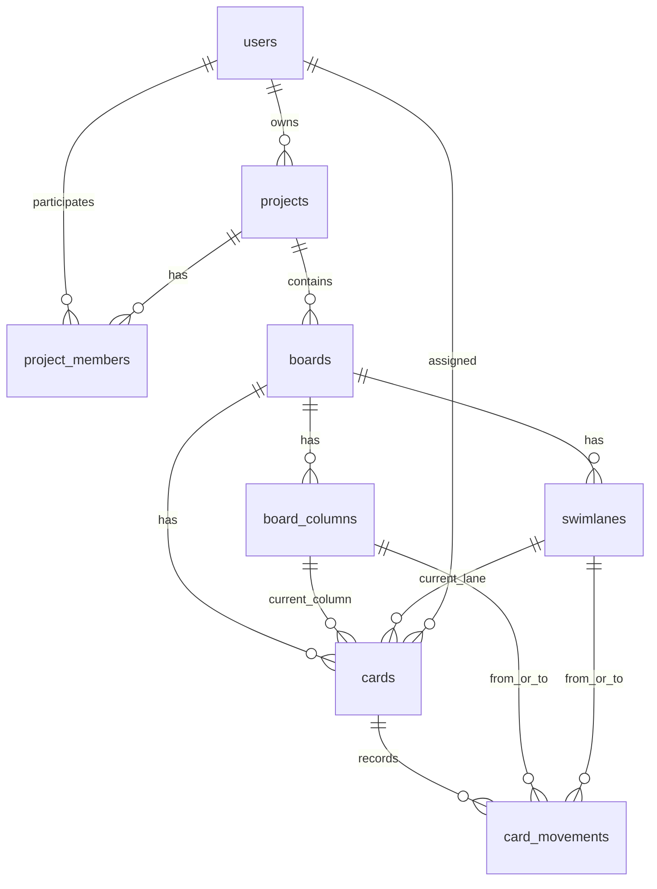

# Projeto Fisico do Banco de Dados

## Finalidade

Este documento descreve o projeto fisico do banco de dados do Wiigu. O objetivo e registrar tabelas, colunas, tipos, chaves, relacionamentos e o proposito textual de cada tabela.

## Visao geral

O banco de dados armazena usuarios, projetos, participacao em projetos, quadros Kanban, colunas, raias, cartoes e movimentacoes. As metricas Kanban sao calculadas a partir desses dados, principalmente datas dos cartoes e historico de movimentacoes.

## Tabela: users

Proposito: armazenar usuarios cadastrados no sistema.

| Coluna | Tipo | Chave | Descricao |
| --- | --- | --- | --- |
| `id` | INTEGER | PK | Identificador interno do usuario. |
| `name` | TEXT |  | Nome do usuario. |
| `email` | TEXT | UNIQUE | Email usado para login. |
| `google_sub` | TEXT | UNIQUE | Identificador da conta Google, quando o login federado estiver configurado. |
| `password_hash` | TEXT |  | Senha armazenada de forma protegida. |
| `created_at` | TEXT |  | Data de criacao do registro. |

## Tabela: projects

Proposito: representar projetos gerenciados no Wiigu.

| Coluna | Tipo | Chave | Descricao |
| --- | --- | --- | --- |
| `id` | INTEGER | PK | Identificador interno do projeto. |
| `name` | TEXT |  | Nome do projeto. |
| `description` | TEXT |  | Descricao do projeto. |
| `owner_id` | INTEGER | FK users.id | Usuario criador ou responsavel pelo projeto. |
| `created_at` | TEXT |  | Data de criacao do projeto. |

## Tabela: project_members

Proposito: associar usuarios a projetos.

| Coluna | Tipo | Chave | Descricao |
| --- | --- | --- | --- |
| `id` | INTEGER | PK | Identificador da associacao. |
| `project_id` | INTEGER | FK projects.id | Projeto associado. |
| `user_id` | INTEGER | FK users.id | Usuario participante. |
| `role` | TEXT |  | Papel do usuario no projeto. |
| `created_at` | TEXT |  | Data de criacao da associacao. |

Restricao: a combinacao `project_id` e `user_id` deve ser unica.

## Tabela: boards

Proposito: armazenar quadros Kanban de um projeto.

| Coluna | Tipo | Chave | Descricao |
| --- | --- | --- | --- |
| `id` | INTEGER | PK | Identificador interno do quadro. |
| `project_id` | INTEGER | FK projects.id | Projeto ao qual o quadro pertence. |
| `name` | TEXT |  | Nome do quadro. |
| `description` | TEXT |  | Descricao do quadro. |
| `created_at` | TEXT |  | Data de criacao do quadro. |

## Tabela: board_columns

Proposito: representar colunas do fluxo Kanban de um quadro.

| Coluna | Tipo | Chave | Descricao |
| --- | --- | --- | --- |
| `id` | INTEGER | PK | Identificador interno da coluna. |
| `board_id` | INTEGER | FK boards.id | Quadro ao qual a coluna pertence. |
| `name` | TEXT |  | Nome da coluna. |
| `position` | INTEGER |  | Ordem de exibicao da coluna. |
| `wip_limit` | INTEGER |  | Numero maximo de cartoes permitido na coluna. |
| `created_at` | TEXT |  | Data de criacao da coluna. |

Observacao: cada quadro deve possuir as colunas obrigatorias `A FAZER`, `FAZENDO` e `FEITO`.

## Tabela: swimlanes

Proposito: representar raias de um quadro Kanban.

| Coluna | Tipo | Chave | Descricao |
| --- | --- | --- | --- |
| `id` | INTEGER | PK | Identificador interno da raia. |
| `board_id` | INTEGER | FK boards.id | Quadro ao qual a raia pertence. |
| `name` | TEXT |  | Nome da raia. |
| `position` | INTEGER |  | Ordem de exibicao da raia. |
| `created_at` | TEXT |  | Data de criacao da raia. |

## Tabela: cards

Proposito: armazenar cartoes de atividade.

| Coluna | Tipo | Chave | Descricao |
| --- | --- | --- | --- |
| `id` | INTEGER | PK | Identificador interno do cartao. |
| `code` | TEXT | UNIQUE | Identificador visivel do cartao. |
| `board_id` | INTEGER | FK boards.id | Quadro ao qual o cartao pertence. |
| `column_id` | INTEGER | FK board_columns.id | Coluna atual do cartao. |
| `swimlane_id` | INTEGER | FK swimlanes.id | Raia atual do cartao. |
| `title` | TEXT |  | Nome do cartao. |
| `description` | TEXT |  | Descricao da atividade. |
| `assignee_id` | INTEGER | FK users.id | Usuario responsavel, quando cadastrado. |
| `assignee_name` | TEXT |  | Nome do responsavel para demonstracao simples. |
| `priority` | TEXT |  | Prioridade do cartao. |
| `due_date` | TEXT |  | Data limite para termino. |
| `created_at` | TEXT |  | Data de criacao do cartao. |
| `started_at` | TEXT |  | Data da primeira entrada em `FAZENDO`. |
| `completed_at` | TEXT |  | Data de entrada em `FEITO`. |

## Tabela: card_movements

Proposito: registrar movimentacoes de cartoes para permitir rastreabilidade e calculo de metricas.

| Coluna | Tipo | Chave | Descricao |
| --- | --- | --- | --- |
| `id` | INTEGER | PK | Identificador interno da movimentacao. |
| `card_id` | INTEGER | FK cards.id | Cartao movimentado. |
| `from_column_id` | INTEGER | FK board_columns.id | Coluna de origem. |
| `to_column_id` | INTEGER | FK board_columns.id | Coluna de destino. |
| `from_swimlane_id` | INTEGER | FK swimlanes.id | Raia de origem. |
| `to_swimlane_id` | INTEGER | FK swimlanes.id | Raia de destino. |
| `moved_at` | TEXT |  | Data da movimentacao. |

## Relacionamentos principais

- Um usuario pode possuir varios projetos.
- Um projeto pode ter varios membros.
- Um projeto pode ter varios quadros.
- Um quadro possui varias colunas.
- Um quadro possui varias raias.
- Um quadro possui varios cartoes.
- Um cartao pertence a uma coluna e a uma raia.
- Um cartao pode ter varias movimentacoes.
- Uma movimentacao pode registrar mudanca de coluna, mudanca de raia ou ambas.

## Diagrama fisico

## Metricas derivadas

- Work-in-progress: quantidade de cartoes atualmente em colunas que ainda nao representam conclusao.
- Throughput: quantidade de cartoes concluidos em determinado periodo.
- Lead time: diferenca entre `created_at` e `completed_at`.
- Cycle time: diferenca entre `started_at` e `completed_at`.

## Relacao com outros artefatos

O banco fisico suporta as historias de usuario, os wireframes e o prototipo. Qualquer mudanca em entidades, campos ou relacionamentos deve ser refletida na arquitetura, na UX e nos testes.
